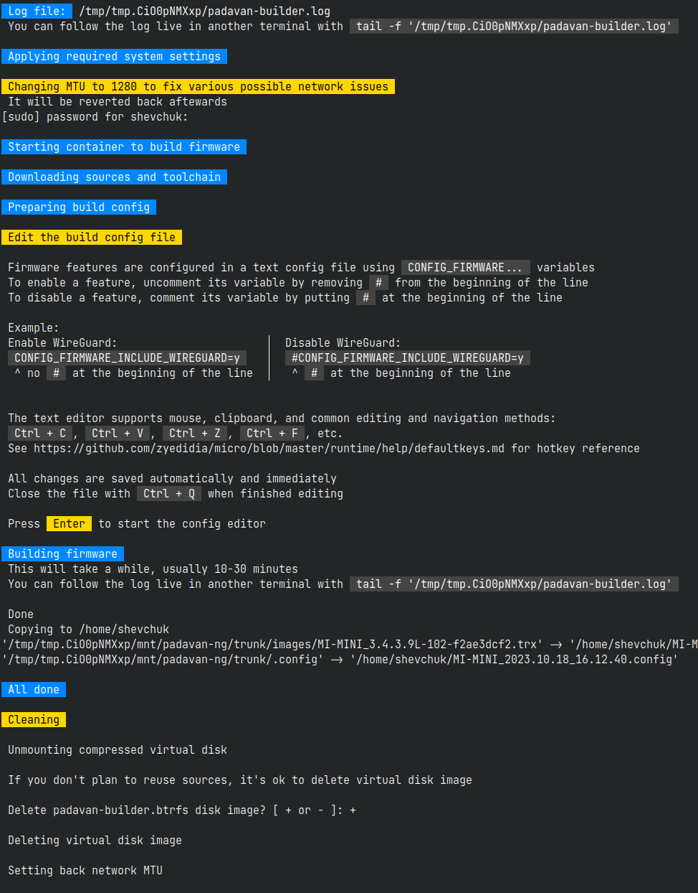
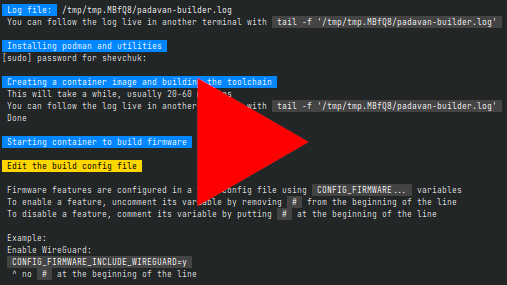

<p align="right">English | <a href="README.ru.md">Русский</a></p>

## Padavan builder

Automated Padavan firmware builder. Runs on almost any modern Linux. Windows can run it with Windows Subsystem for Linux (WSL) or virtual machine.

**Screenshots:**

<details>
  <summary>Full script output</summary>

  
</details>

<details>
  <summary>Build config selection</summary>

  
</details>

<details>
  <summary>Build config editing</summary>

  
</details>

**Video demo, ⏱️ ~3 min:**

[](https://youtu.be/AX7YRaR9CBw)


### Usage

```sh
wget -qO- https://github.com/shvchk/padavan-builder/raw/main/build.sh | bash
```

> [!WARNING]  
> I recommend inspecting the [build.sh](build.sh) script before running it. It's a good practice before running any code on your machine, especially remote code.

The script will do the following:

- Run a [Podman](https://podman.io) container with all necessary dependencies

- Download Padavan firmware sources and prebuilt toolchain

- **Ask you to select your router model**

  The model list can be filtered with text input. Use `↑` `↓` arrows to select your model, press `Enter` to confirm.

- **Open the build config file in a text editor** ([micro](https://micro-editor.github.io))

  Edit config to your liking: uncomment (remove `#` at the beginning of the line) features you need, comment features you don't.

  Text editor fully supports mouse, clipboard and common editing and navigation methods: `Ctrl + C`, `Ctrl + V`, `Ctrl + Z`, `Ctrl + F`, etc.

  Changes are saved automatically. Close the file (`Ctrl + Q`) when finished.

- Build the firmware in a temporary Podman container

- Put the firmware (`trx` or `bin` file) and build config to your home directory (Linux) or Downloads directory (Windows)


It will ask you additional questions when neccessary, usually about reusing sources and binaries. You can make script completely automated and non-interactive, though, see [Advanced usage](#advanced-usage).

Downloaded source code and produced binaries are stored in a compressed virtual disk file, so script only uses ~3 GB storage max. After build, you have an option to delete this virtual disk file, or keep it for later use.

Color coding of the script output:

- blue background or no styling is used for informational messages
- yellow background indicates warnings or something that may require user action
- red background indicates errors


### Advanced usage

You can alter script behaivor with variables, either set using `export` as an environment variables or in a file: `~/.config/padavan-builder` by default. All these variables and their default values are specified at the beginning of the [`build.sh`](build.sh) script.

Variable                    | Description
----------------------------|------------------------------------------------------
`PADAVAN_REPO`              | Firmware repository
`PADAVAN_BRANCH`            | Firmware repository branch
`PADAVAN_TOOLCHAIN_URL`     | Prebuilt toolchain URL
`PADAVAN_IMAGE`             | Container image used to build the firmware
`PADAVAN_CONFIG`            | Build config file path, allows to skip config editing
`PADAVAN_EDITOR`            | Text editor, in case you don't like `micro`
`PADAVAN_DEST`              | Path, where firmware should be copied after building
`PADAVAN_REUSE`             | Set if script should save and reuse sources and binaries (`true`), or delete everything and start from scratch (`false`), allows to skip relevant questions. Reuse, especially binaries reuse, can drastically reduce time for subsequent builds
`PADAVAN_UPDATE`            | If sources already exist and are reused, set if script should reset and update sources to the latest version (`true`), or proceed as is (`false`), allows to skip relevant question
`PADAVAN_BUILD_CONTAINER`   | Build container image locally (`true`) or use prebuilt container image (default)
`PADAVAN_CONTAINERFILE`     | Containerfile / Dockerfile to be used to build container image locally
`PADAVAN_BUILD_TOOLCHAIN`   | Build toolchain locally (`true`) or use prebuilt toolchain (default)
`PADAVAN_BUILD_ALL_LOCALLY` | Build container image and toolchain locally (`true`) or use prebuilt (default)
`PADAVAN_BUILDER_CONFIG`    | Builder config file, where you can set any of the above variables in one place
