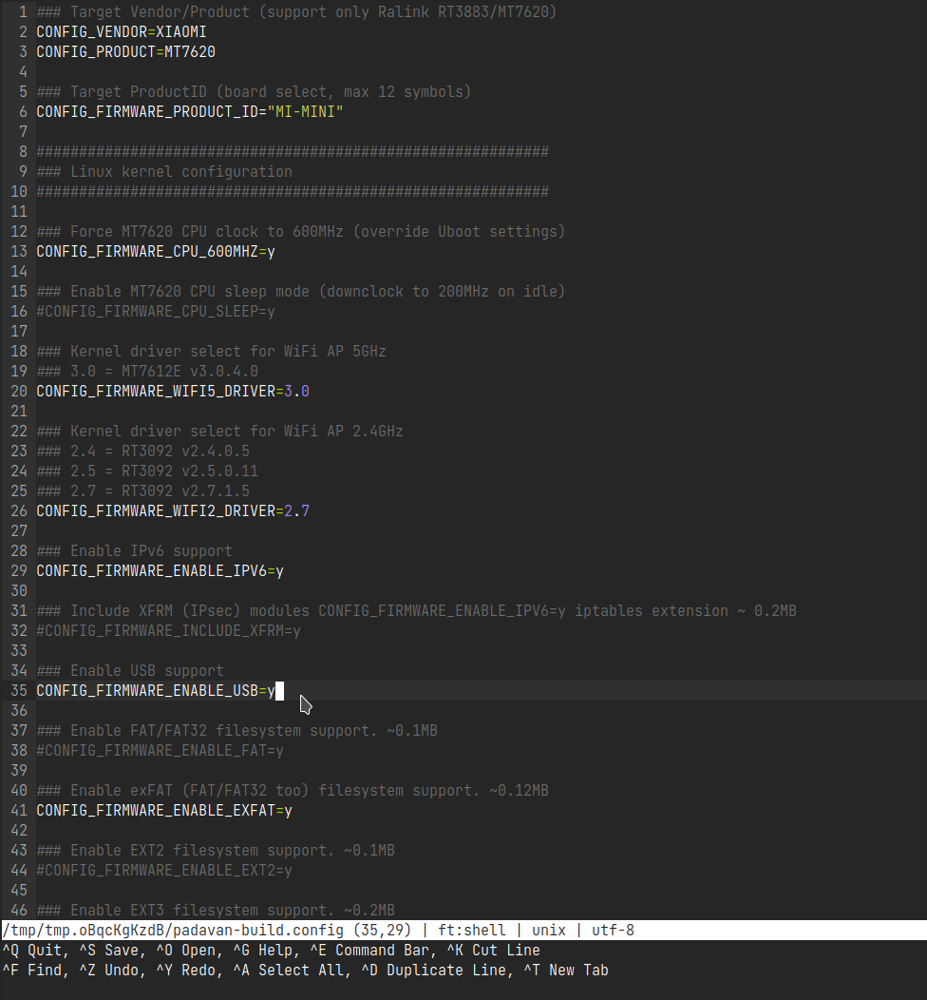

<p align="right">English | <a href="README.ru.md">Русский</a></p>

## Padavan builder

Automated Padavan firmware builder. Runs on Debian or Ubuntu, including in Windows Subsystem for Linux (WSL).

**Screenshots:**

<details>
  <summary>Full script output</summary>

  
</details>

<details>
  <summary>Build config selection</summary>

  
</details>

<details>
  <summary>Build config editing</summary>

  
</details>

<br/>

**Video demo, ⏱️ ~3 min:**

[](https://youtu.be/AX7YRaR9CBw)


### Usage

```sh
wget -qO- https://github.com/shvchk/padavan-builder/raw/main/host.sh | bash
```

I recommend inspecting the [host.sh](host.sh) script before running it. It's a good practice before running any code on your machine, especially remote code.

The script will do the following (manual steps in bold, everything else is automated):

- Create a [Podman](https://podman.io) container template (image) with all necessary dependencies

- Get Padavan sources

- Build the toolchain

- **Ask you to select your router model**

  The model list can be filtered with text input. Use `↑` `↓` arrows to select your model, press `Enter` to confirm.

- **Open the build config file in a text editor** ([micro](https://micro-editor.github.io))

  Edit config to your liking: uncomment (remove `#` at the beginning of the line) features you need, comment features you don't.

  Text editor fully supports mouse, clipboard and common editing and navigation methods: `Ctrl + C`, `Ctrl + V`, `Ctrl + X`, `Ctrl + Z`, `Ctrl + F`, etc.

  Save (`Ctrl + S`) and close (`Ctrl + Q`) the file when finished.

- Build the firmware in a temporary Podman container

- Put the built firmware (`trx` file) in your home directory (Linux) or `C:/Users/Public/Downloads/padavan` (WSL)


### Reuse / rebuild

The script won't delete Podman image with toolchain after building the firmware, so you can reuse it.

To rebuild firmware, just rerun the script as usual, it will detect existing image and ask you if you want to use it or delete and rebuild it.


### Clean / uninstall

To delete everything, just run:

```sh
podman system reset -f
```

The only thing left would be the `podman` package itself, all data will be deleted.


### Use another repository or branch

By default, the script uses [gitlab.com/hadzhioglu/padavan-ng](https://gitlab.com/hadzhioglu/padavan-ng) repository and `master` branch. To use another repository and branch, you can pass it as a parameter to the script: `host.sh <repo_url> <branch>`. When running via a pipe, as we did initially, parameters can be passed like this:

```sh
wget -qO- https://github.com/shvchk/padavan-builder/raw/main/host.sh | \
bash -s -- https://example.com/anonymous/padavan dev
```

In the example above, we use `https://example.com/anonymous/padavan` repo and `dev` branch.

The repository should contain `Dockerfile`.
