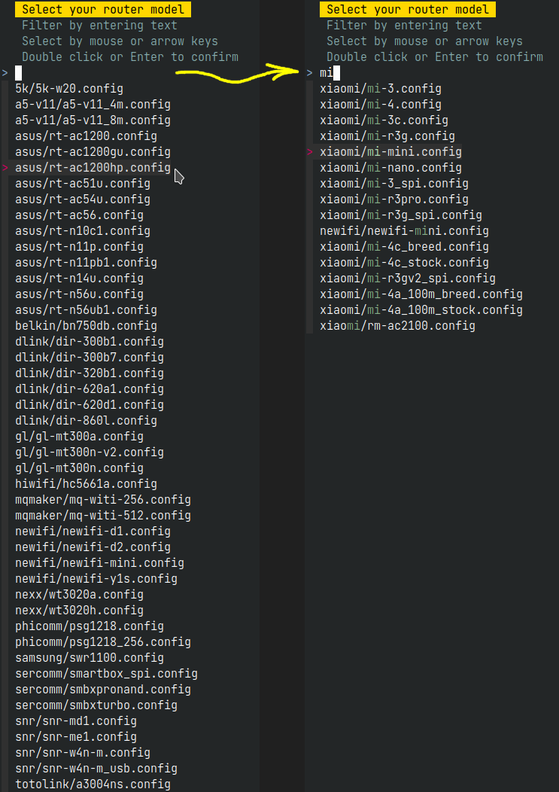

<p align="right"><a href="README.md">English</a> | Русский</p>

## Padavan builder

Автоматизированный сборщик прошивки Padavan. Работает почти на любом современном Linux. На Windows можно запустить используя подсистему Windows для Linux (WSL) или виртуальную машину.

**Скриншоты:**

<details>
  <summary>Полный вывод скрипта</summary>

  
</details>

<details>
  <summary>Выбор конфига сборки</summary>

  
</details>

<details>
  <summary>Редактирование конфига сборки</summary>

  
</details>

**Видео, ⏱️ ~3 min:**

[](https://youtu.be/AX7YRaR9CBw)


### Использование

```sh
wget -qO- https://github.com/shvchk/padavan-builder/raw/main/build.sh | bash
```

> [!WARNING]  
> Рекомендую проверить скрипт [build.sh](build.sh) перед запуском. Это хорошая практика перед запуском любого кода на вашем компьютере, особенно удалённого кода.

Скрипт сделает следующее (шаги, требующие ручного вмешательства, выделены жирным, всё остальное автоматизировано):

- Создаст заготовку контейнера [Podman](https://podman.io) (образ) со всеми необходимыми зависимостями

- Скачает исходные коды Padavan

- Соберёт тулчейн

- **Предложит выбрать модель роутера**

  Список моделей можно фильтровать вводом текста. Используйте стрелки `↑` `↓` для выбора модели, нажмите `Enter` для подтверждения.

- **Откроет файл настройки сборки в текстовом редакторе** ([micro](https://micro-editor.github.io))

  Отредактируйте файл на ваше усмотрение: раскомментируйте (удалите `#` в начале строки) функции, которые вам нужны, закомментируйте те, которые не нужны.

  В редакторе полноценно работает мышь, буфер обмена и привычные методы редактирования и навигации: `Ctrl + C`, `Ctrl + V`, `Ctrl + X`, `Ctrl + Z`, `Ctrl + F` и т.п.

  Сохраните (`Ctrl + S`) и закройте (`Ctrl + Q`) файл, когда закончите.

- Соберёт прошивку

- Поместит готовую прошивку (`trx` файл) в домашнюю папку (Linux) или в `C:/Users/Public/Downloads/padavan` (WSL)


### Использование другого репозитория или ветки

По умолчанию скрипт использует репозиторий [gitlab.com/hadzhioglu/padavan-ng](https://gitlab.com/hadzhioglu/padavan-ng) и `master` ветку. Чтобы использовать другой репозиторий и ветку, можно передать их скрипту как параметр: `build.sh <ссылка_на_репозиторий> <ветка>` или использовать переменные окружения `PADAVAN_REPO` и `PADAVAN_BRANCH`. Переданные параметры имеют приоритет над переменными окружения.

При запуске через пайп, как мы изначально и делали, другой репозиторий и ветку можно указать так:

```sh
wget -qO- https://github.com/shvchk/padavan-builder/raw/main/build.sh | \
bash -s -- https://example.com/anonymous/padavan dev
```

или

```sh
PADAVAN_REPO=https://example.com/anonymous/padavan \
PADAVAN_BRANCH=dev \
wget -qO- https://github.com/shvchk/padavan-builder/raw/main/build.sh | bash

```
